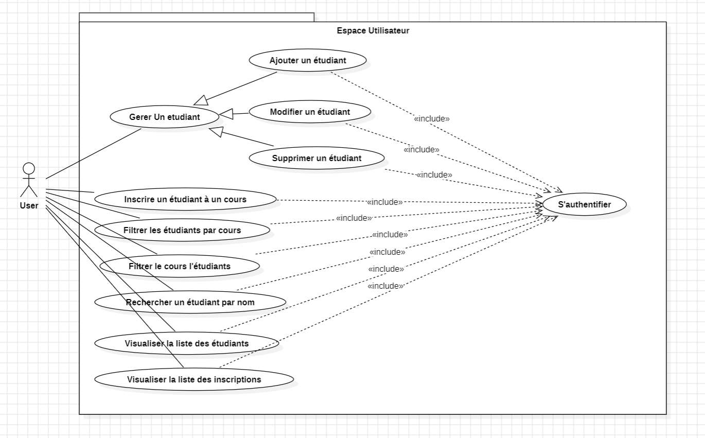
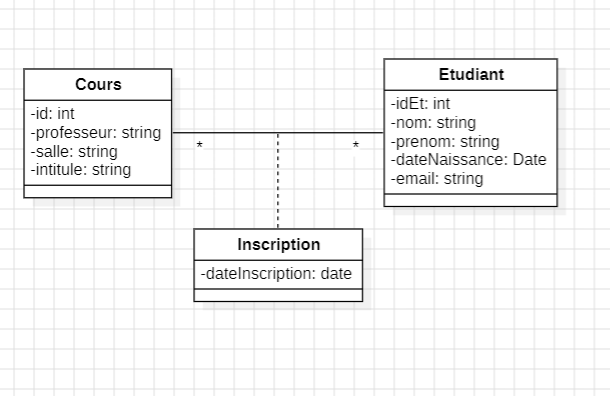
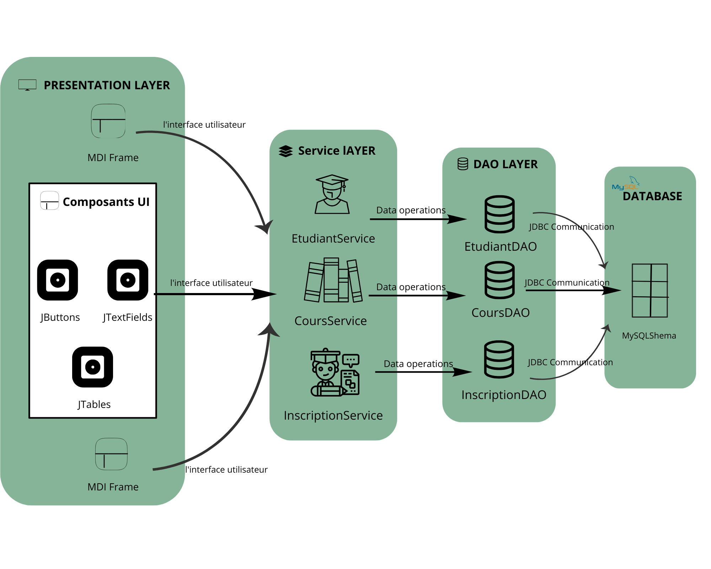

# 📚 Gestion des Étudiants et Inscriptions

## FAeducation:
<div align="center">
  
</div>

Est une plateforme de gestion des étudiants et des inscriptions .


---

## 📁 Table de matieres

- [🗂 Contexte](#-Contexte)
- [❓ Problématique](#-Problématique)
- [🎯 Objectif](#-Objectif)
- [📊 Diagrammes](#-Diagrammes)
- [🗃 Tables de Données](#-Tables-de-Données)
- [✨ Fonctionnalités Principales](#-Fonctionnalités-Principales)
- [🔍 Requêtes SQL](#-Requêtes-sql)
- [🏛 Architecture](#-Architecture)
- [🛠 Technologies Utilisées](#-Technologies-Utilisées)
- [🎥 Démo Vidéo](#-Démo-video)
- [📁 .exe](#-.exe)

---

## 🗂 Contexte :

Dans le cadre de la gestion académique, il est essentiel d'assurer un suivi efficace des étudiants et de leurs inscriptions aux cours. Les méthodes traditionnelles de gestion manuelle ou basées sur des fichiers statiques peuvent conduire à des erreurs, une perte de temps et une mauvaise organisation. Un système informatisé permettrait une gestion plus fluide et efficace des inscriptions aux cours, tout en offrant une meilleure expérience aux étudiants et aux administrateurs.

---
## ❓ Problématique:

Les universités et institutions académiques rencontrent souvent des difficultés dans la gestion des inscriptions aux cours. Les systèmes obsolètes ou la gestion manuelle peuvent engendrer :

Des erreurs d'inscription,

Un manque de suivi des étudiants par cours,

Des difficultés dans la recherche et la gestion des informations académiques,

Une expérience utilisateur peu optimisée pour les administrateurs et les étudiants.


---
## 🎯 Objectif:

L'objectif de ce projet est de développer une application qui facilite la gestion des étudiants et de leurs inscriptions aux cours.


---
## L'application doit :

Permettre un suivi précis des inscriptions aux cours,

Optimiser la gestion des étudiants et des cours,

Offrir des outils de recherche et de filtrage avancés pour une meilleure expérience utilisateur,

Fournir une visualisation claire des inscriptions aux cours.

---
## 📊 Diagrammes :

##  Diagramme use case:

 

---
##  Diagramme de classe :

 

---
## 🗃 Tables de Données:

Etudiant (id, nom, prénom, date_naissance, email)

Cours (id, intitule, professeur, salle)

Inscription ( etudiant_id, cours_id, date_inscription)


---
## ✨ Fonctionnalités Principales:

### 1. Gestion des étudiants
- **Ajouter un étudiant** : Formulaire pour saisir le nom, prénom, date de naissance, etc.
- **Modifier un étudiant** : Mettre à jour les informations d'un étudiant existant.
- **Supprimer un étudiant** : Retirer un étudiant de la base de données.

### 2. Inscription des étudiants aux cours
- **Inscrire un étudiant à un cours** : Sélectionner un étudiant et un cours dans des listes déroulantes.
- **Retirer un étudiant d'un cours** : Désinscrire un étudiant d'un cours sélectionné.

### 3. Filtrage des inscriptions
- **Filtrer les étudiants par cours** : Afficher la liste des étudiants inscrits à un cours spécifique.
- **Filtrer les cours par étudiant** : Afficher la liste des cours suivis par un étudiant spécifique.

### 4. Recherche d'étudiants
- **Recherche par nom** : Entrer le nom d'un étudiant pour afficher ses informations et ses inscriptions.


---
##  🔍 Requêtes sql 

### Tables

```sql

CREATE TABLE Cours (
    id INT NOT NULL AUTO_INCREMENT,
    intitule VARCHAR(100) NOT NULL,
    professeur VARCHAR(100) NOT NULL,
    salle VARCHAR(10) NOT NULL,
    PRIMARY KEY (id)
) ;


CREATE TABLE étudiant (
    id INT NOT NULL AUTO_INCREMENT,
    nom VARCHAR(50) NOT NULL,
    prenom VARCHAR(50) NOT NULL,
    date_naissance DATE NOT NULL,
    email VARCHAR(100) NOT NULL,
    PRIMARY KEY (id)
);

CREATE TABLE inscription (
    etudiant_id INT NOT NULL,
    cours_id INT NOT NULL,
    date_inscription DATE DEFAULT CURRENT_DATE,
    PRIMARY KEY (etudiant_id, cours_id),
    FOREIGN KEY (etudiant_id) REFERENCES Etudiants(id),
    FOREIGN KEY (cours_id) REFERENCES Cours(id)
) ;

CREATE TABLE user (
    login VARCHAR(50) NOT NULL,
    password VARCHAR(100) NOT NULL,
    PRIMARY KEY (login)
) ;
```

## 🏛  Architecture

 

---
## 🛠 Technologies Utilisées:

- **Framework d'interface graphique :** Java Swing
- **Base de données :** MySQL
- **Accès aux données :** JDBC
- **Outils de développement :**
NetBeans (IDE Java)
StarUml (Outil de diagramme)
- **Gestion de base de données :** phpMyAdmin
- **Bibliothèque d'icônes :** Icons8

---

## 🎥 Démo video 
https://github.com/user-attachments/assets/79e2ff72-957f-4c00-8d75-cc7b8a502754
